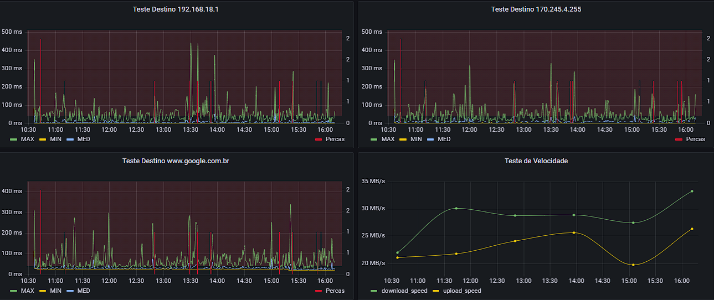

# Xperf

O Xperf é uma aplicação projetada para coletar e analisar informações de desempenho de redes. Ele permite a realização de testes de ping e testes de velocidade de internet, armazenando os resultados em um banco de dados MySQL. Esses resultados podem ser usados para obter insights sobre a qualidade da conexão e auxiliar na otimização da rede.

## Características Principais

- Coleta de informações detalhadas de equipamentos, incluindo marca, modelo e endereço MAC.
- Realização automatizada de testes de ping para destinos específicos.
- Execução periódica de testes de velocidade de internet (download/upload).
- Armazenamento organizado dos resultados em um banco de dados MySQL.
- Visualização dos dados coletados para análise e tomadas de decisões informadas.

## Motivação

O projeto Xperf surgiu com o objetivo de simplificar a avaliação de desempenho de redes e facilitar a detecção de problemas de conectividade. Ele oferece uma solução eficiente para monitorar a estabilidade e a velocidade da rede, beneficiando profissionais de TI, administradores de rede e entusiastas.

## Instalação e Uso

### Pré-requisitos

- Python 3.x
- Bibliotecas Python: ping3, speedtest-cli, tqdm, mysql-connector-python

### Instalação

1. Clone este repositório para sua máquina local:

git clone https://github.com/thiagof2755/Xperf.git

2. Instale as dependências do projeto:

### Configuração

1. Crie um banco de dados MySQL e configure as credenciais nos arquivos `main.py` e `database_functions.py`.
2. Utilize o script fornecido no repositório para criar as tabelas necessárias no banco de dados.
3. Execute o arquivo `main.py` para coletar e armazenar os dados.

## Uso

1. Execute o arquivo `main.py` para iniciar a coleta de dados.
2. Acompanhe o progresso dos testes exibidos no terminal.
3. Os resultados serão armazenados no banco de dados e estarão disponíveis para análise posterior.

## Estrutura do Projeto

- `main.py`: Arquivo principal que inicia a coleta de dados.
- `PingController.py`: Controlador para testes de ping.
- `SpeedTestController.py`: Controlador para testes de velocidade.
- `SpeedTestModel.py`: Modelo para testes de velocidade.
- `EquipmentInfo.py`: Classe para inserção de informações de equipamentos no banco de dados.
- `database_functions.py`: Funções para interagir com o banco de dados.
- `View.py`: Interface de usuário utilizando PySimpleGUI.
- Outros arquivos conforme necessário.

## Visualização da Dashboard

Para visualizar os dados coletados pelo Xperf, você pode utilizar o Grafana, uma ferramenta poderosa para criação de dashboards e visualização de dados. Na pasta `dashboard`, você encontrará um arquivo de configuração `xperf_dashboard.json`. Importe esse arquivo no Grafana para criar uma dashboard pré-configurada com os resultados dos testes de ping e velocidade.

## Contribuição

Contribuições são bem-vindas! Caso queira adicionar recursos, corrigir problemas ou melhorar a documentação, faça um fork deste repositório, implemente suas melhorias e envie um pull request. Juntos, podemos aprimorar o Xperf e torná-lo ainda mais poderoso.

## Licença

Este projeto é licenciado sob a Licença MIT.

---

Criado por Thiago Alves da Silva Filho - thiagof2755@gmail.com
